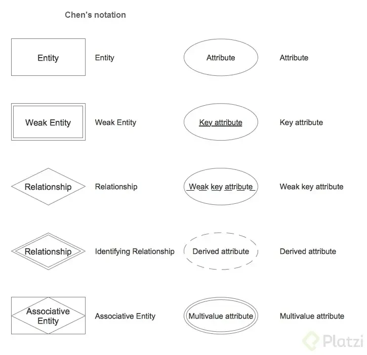
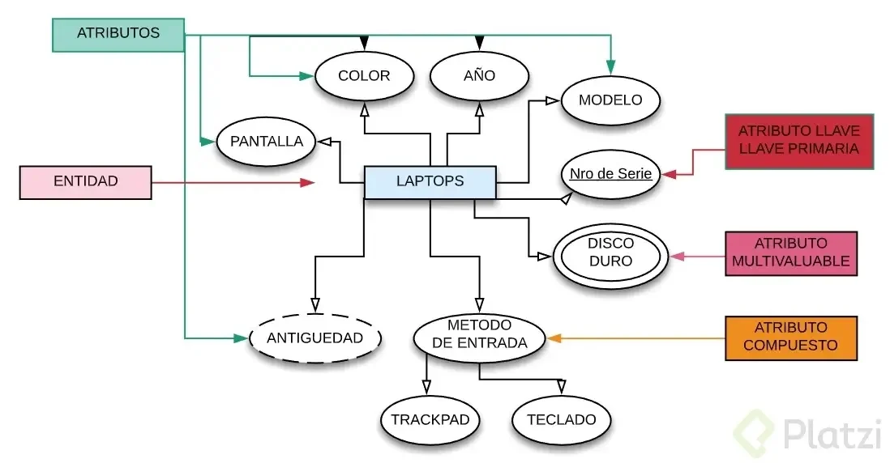
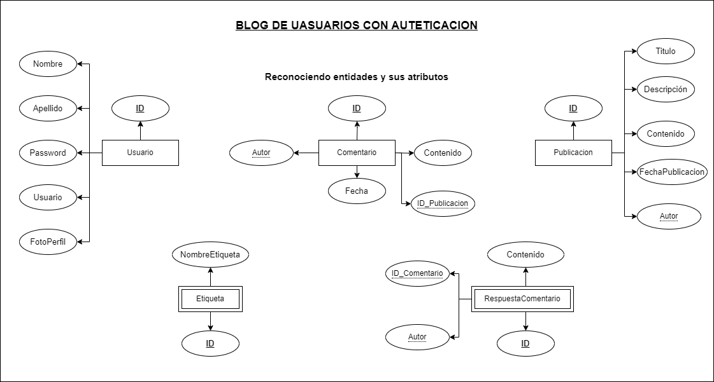
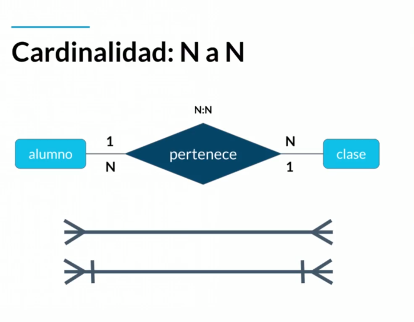
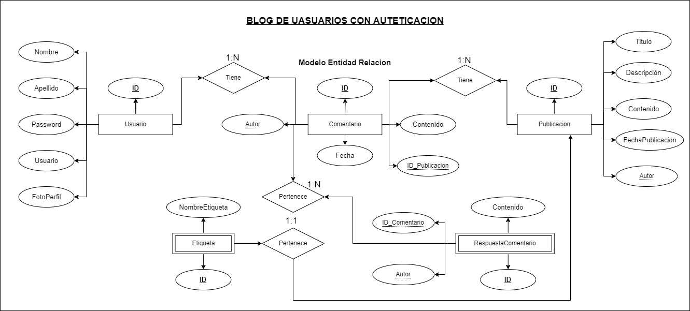
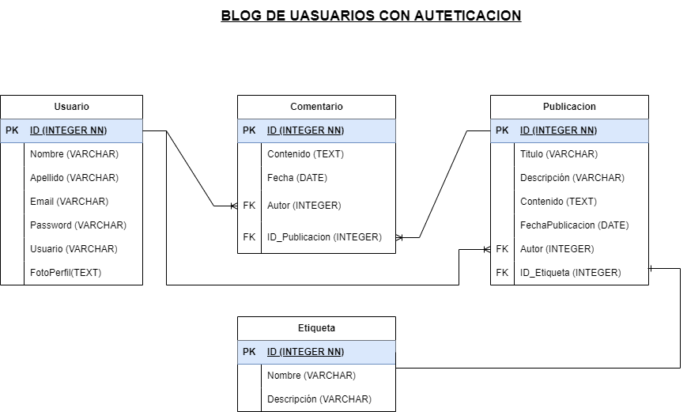
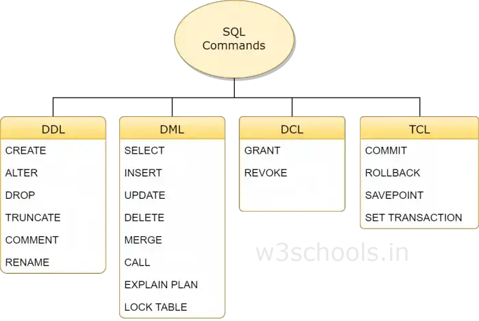

# Fundamentos de base de datos

## Bienvenida conceptos básicos y contexto histórico de las Bases de Datos

#### Historia de la persistencia de la informacion

- la persistencia de datos se dio paso a lo rapido que podia distorcionarse la informacion.
- antiguamente se los datos presistian en piedras, para luego pasar a hojas, dispositivos digitales, ahora hoy en dia la informacion persiste en la nube

##### **Que son las bases de datos?**:

Las bases de datos durgieron durante le tiempo de transicion de dipositivos digitales y la nube. Estas bases de datos se encargan de guardar informacion. Existen 2 tipos de bases de datos:

- Bases de datos relacionales: Son aquellas que utilizan el modelo relacionala y alamacenar datos en tablas y que estas estan interconectadas mediante una relacion algunos de estos que son relacionales son: `SQL Server, MAriaDB, MySql, PosgreSQL, Oracle`
- Bases de datos no relacionales: Este tipo de base de datos se caracteriza por no usar usar el modelo relacional. Sus caracteristicas prinsipales son:
  - Documentales: Almacenan datos en documentos, como JSON o XML. Ejemplos: MongoDB, Couchbase.
  - Clave-Valor: Almacenan datos en pares clave-valor. Ejemplos: Redis, Amazon DynamoDB.
  - Columnares: Almacenan datos en columnas en lugar de filas, lo que permite un alto rendimiento en consultas analíticas. Ejemplos: Apache Cassandra, HBase.
  - Grafos: Almacenan datos en nodos y relaciones en un gráfico. Ejemplos: Neo4j, Amazon Neptune.
    aqui se presentatn los tipos de base de datos no relacionales: `cassandra, elasticsearch, neo4j, MongoDB`

## Introducción a las bases de datos relacionales

### Historia de las bases de datos relacionales

- Como ya se menciono las bases de datos relacionales nacen a la necesidad de perisistir datos mas alla de lo que existen en la memoria RAM.
- Antes toda la informacion se guardaba en archivos con texto plano, pero poder recuperar esa informacion de forma ordenada se haci muy dificil lo que foemento la creacion de bases de datos relacionales

### Qué son entidades y atributos?

- una `entidad` simula a un objeto, es decir representa a un objeto del mundo real, en las DB Relacionales
- Existen 2 tipos de entidades:
  - Entidades fuertes: Son aquellas entidades que no dependen de otras entidades
  - Entidades debiles: Son aquellas entidades que no pueden axistir sin una entidad fuerte
    - Entidades débiles por identidad: no se diferencian entre sí más que por la clave de su identidad fuerte.
    - Entidades débiles por existencia: se les asigna una clave propia.
- Como se representan las entidades:

  

- Ejemplo de entidad en DB

- un `atributo` es una caracteristica peteneciente a la entidad, estas se dividen en dos:

  - `monovaluado` significa tiene un solo valor
  - `multivaluados` significa que tiene mas de un valor
  - Atributos llave que nos ayudan a darle un identificador a dato dentro de la entidad estos atributos son unicos y se dividen en dos:
    - Naturales: Es inherente al objeto
    - Artifisial: Este no viene con el objeto entoces se crea uno para relacionarlo

- Diagrama del Proyecto

### Relaciones

- Las relaciones nos permiten unir entidades se representan con rombos, por convencion se definen a traves de verbos

- Las relaciones tienen una propidad llamda cardinalidad cuantos pertenecen de un lado pertenecen a cuantos del otro lado
- Se tienen la siguientes cardinalidades
  - 1 a 1: Cardinalidad de uno a uno
  - 0 a 1: este es una cardinalidad opcional
  - 1 a N: Cardinalida de uno a muchos
  - 0 a N: este es una cardinalidad opcional

### Multiples muchos

- Cardihnalidad de muchos a muchos

### Diagramas Entidad Relacion

- Un diagrama es como un mapa que nos ayuda a identificar cuales son las entidades, las relaciones, etc.

- Diagrama del proyecto

### Diagrama Físico: tipos de datos y constraints

- Tipos de datos

| Tipos de Datos de Texto | Descripción                                                                | Tipos de Datos de Números | Descripción                                    |
| ----------------------- | -------------------------------------------------------------------------- | ------------------------- | ---------------------------------------------- |
| VARCHAR(n)              | Cadena de caracteres de longitud variable con un máximo de 'n' caracteres. | INT                       | Número entero.                                 |
| CHAR(n)                 | Cadena de caracteres de longitud fija con exactamente 'n' caracteres.      | FLOAT                     | Número decimal de precisión simple.            |
| TEXT                    | Cadena de caracteres de longitud variable para textos largos.              | DOUBLE                    | Número decimal de precisión doble.             |
|                         |                                                                            | DECIMAL(p, s)             | Número decimal con precisión 'p' y escala 's'. |
|                         |                                                                            | BIGINT                    | Número entero largo.                           |
|                         |                                                                            | SMALLINT                  | Número entero pequeño.                         |

| Tipos de Datos de Fechas | Descripción                                                   | Tipos de Datos Lógicos | Descripción                                           |
| ------------------------ | ------------------------------------------------------------- | ---------------------- | ----------------------------------------------------- |
| DATE                     | Representa una fecha en formato 'YYYY-MM-DD'.                 | BOOLEAN                | Representa un valor verdadero (TRUE) o falso (FALSE). |
| TIME                     | Representa una hora en formato 'HH:MM:SS'.                    |                        |                                                       |
| DATETIME                 | Representa una fecha y hora en formato 'YYYY-MM-DD HH:MM:SS'. |                        |                                                       |
|                          |                                                               |                        |                                                       |

- Constraints (Restricciones)

| Restricción    | Descripción                                                                                            |
| -------------- | ------------------------------------------------------------------------------------------------------ |
| PRIMARY KEY    | Identifica de manera única una fila en una tabla.                                                      |
| FOREIGN KEY    | Crea una relación entre dos tablas y establece la integridad referencial.                              |
| UNIQUE         | Garantiza que los valores en una columna sean únicos en cada fila.                                     |
| NOT NULL       | Asegura que un campo no pueda tener valores nulos.                                                     |
| CHECK          | Define una condición que los valores de una columna deben cumplir.                                     |
| DEFAULT        | Establece un valor predeterminado para una columna cuando no se proporciona un valor en una inserción. |
| AUTO_INCREMENT | Incrementa automáticamente un valor entero cada vez que se inserta una nueva fila en la tabla.         |

### Diagrama Físico: normalización

- La normalizacion nos ayuda a dejar todo en una forma normal estas se basna en lo que son las [12 reglas de Codd](./12ReglasCodd.md)
- por lo que acontinuacion se presenta las concideraciones que se debe tomar al momento de normalizar

| Forma Normal               | Regla                                      | Descripción Breve                         |
| -------------------------- | ------------------------------------------ | ----------------------------------------- |
| Primera forma normal (1FN) | Atributos atómicos                         | Campos individuales y no repetidos.       |
| Segunda forma normal (2FN) | Cada campo debe depender de clave única    | Atributos ligados completamente a clave.  |
| Tercera forma normal (3FN) | Campos NO clave NO dependen entre sí       | Atributos no clave independientes.        |
| Cuarta forma normal (4FN)  | Trata campos multivalor dependientes clave | Lida con atributos dependientes de clave. |

### Formas normales en Bases de Datos relacionales

Trataremos de enttender las formas normales de unamanera simple:

- Primera Forma normal: estro trata basicamente de que no debe de exitir datos repetidos dentro de una base de datos, una tabla es considerado en primera foorma normal si cump,e lo siguiente:
  - todos los atributos son divicibles
  - No debe existir variacion en el numero de columnas es decir las columnas son los mismos para todos los registros
  - Los campos no clave deben poder identificarse por la clave primaria
  - Independencia de orden
- Segunda Forma Normal (2FN): en esta forma normal nos ayuda a diferenciar los datos en diversas entidades, Una tabla esta en segunda forma normal si cumple:
  - debe estar en `1FN`
  - que no existen dependencias parciales, es decir si no pertenece a ninguna clave automaticamente pertenece a la clave principal
  - Todos los que no son una clave principal deben pertenecer a unicamente a la clave pricipal

- Proyecto

[leer](https://platzi.com/clases/1566-bd/19791-formas-normales-en-db-relacionales/)

## RDBMS (MySQL) o cómo hacer lo anterior de manera práctica

### Instalacion de RDBMS (Windows)

- Hay dos formas de acceder a una base de datos:
  - Instalar en máquina local un administrador de bases relacional.
  - Tener ambientes de desarrollo especiales o servicios cloud.
- utilizaremos [docker](https://www.docker.com/), [docker hub](https://hub.docker.com/), [conectate a la base de datos con DBeaver](https://dbeaver.io/), para tener tu base de datos solo ejecuta [docker-compose](./docker-compose.yml)

### ¿Qué es RDB y RDBMS?

- "`RDBMS`" es la abreviatura de "Relational Database Management System" que se traduce como "Sistema de Gestión de Bases de Datos Relacionales". Estos sistemas utilizan el lenguaje `SQL` (Structured Query Language) para `administrar` y `manipular` bases de datos relacionales. Permite la creación, modificación y consulta de datos estructurados en tablas con relaciones predefinidas. `MySQL` y `PostgreSQL` son ejemplos populares de RDBMS que implementan esta tecnología.

## SQL hasta en la sopa

### Historia de sql

- Este se crea gracias a la necesidad de hacer consultas a la base de datos

### DDL Create

- Sql tiene 2 grnades sublenguajes y lo que se vera hoy es el `DDL`
- el sublenguaje `DDL` es el lenguaje de definicion de datos este nos ayuda a crear la estructura de nuestras bases de datos existen 3 comandos:
  - `CREATE`: Nos permite crear objetos
  - `ALTER`: Ayuda a alterar o modificar entidades.
  - `DROP`:
- DDL nod permite manipoular tres objetos:
  - BasesDeDatos
  - Tablas
  - Vistasa

### DML

- Trata del contenido de la base de datos. son las siglas de `data manipulation language` y sus comandos son:
  - `Insert`: Permite insertar registros a una entidad
  - `Update`: Permite actulizar regitros ya existentes
  - `Delete`: Permite eliminar registros de una entidad
  - `Select`: Trae informacion de las bases de datos

[Documentacion](https://www.w3schools.in/mysql)

### ¿Qué tan standard es SQL?

La utilidad más grande de SQL fue unificar la forma en la que pensamos y hacemos preguntas a un repositorio de datos. Ahora que nacen nuevas bases de datos igualmente siguen tomando elementos de SQL

## Consultas a una base de datos

## Introducción a la bases de datos NO relacionales

## Manejo de modelos de datos en bases de datos no relacionales

## Bases de datos en la vida real

## Bonus
