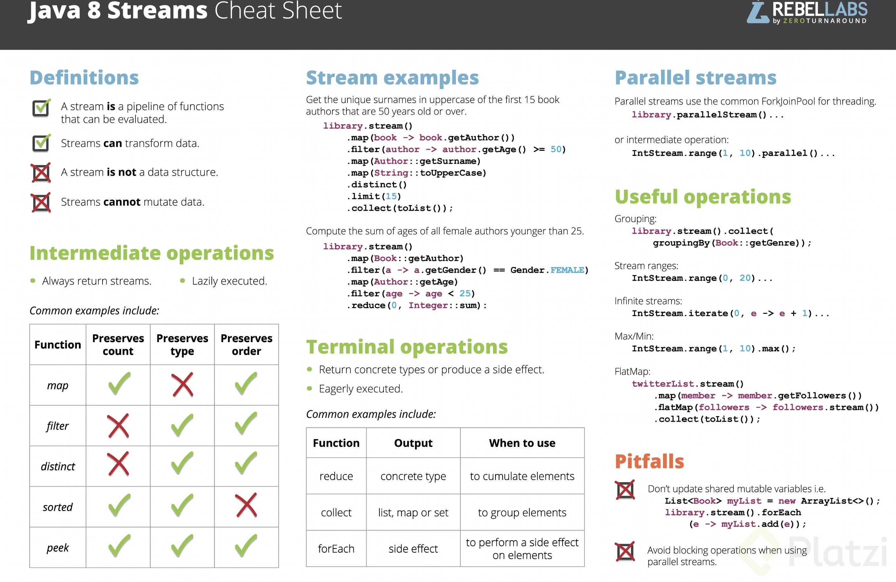

# Programación Funcional Con Java

### ¿Qué es la Programación Funcional?

- La programación funcional es un **paradigma** de programación que trata la computación como la evaluación de **funciones** **matemáticas** y evita el cambio de estado y los datos mutables.
- La programación funcional es declarativa en lugar de imperativa, y el estado de la aplicación fluye a través de funciones puras. En contraste con la programación orientada a objetos, donde el estado de la aplicación generalmente se comparte y se ubica junto con los métodos en los objetos.

### Programación Funcional en Java

- Java 8 introdujo un nuevo paquete `java.util.function` que contiene interfaces funcionales que se pueden usar como **expresiones lambda**.
- Java 8 también introdujo una nueva sintaxis llamada **referencia de método** que se puede usar para expresiones lambda.
- Un ejemplo es la interfaz funcional `Predicate` que tiene un método `test(T t)` que devuelve un valor booleano. Esta interfaz se puede usar para expresiones lambda y referencias de métodos.

```java
public interface Predicate<T> {
    boolean test(T t);
}
public class Example{
    public static void main(String[] args) {
        Predicate<String> predicate = (s) -> !s.isEmpty();
        predicate.test("foo");              // true
        predicate.negate().test("foo");     // false
        Predicate<Boolean> nonNull = Objects::nonNull;
        Predicate<Boolean> isNull = Objects::isNull;
        Predicate<String> isEmpty = String::isEmpty;
        Predicate<String> isNotEmpty = isEmpty.negate();
    }
}
```

### Interfaces Funcionales

- Una interfaz funcional es una interfaz que contiene solo un método abstracto.
- Solo pueden tener una funcionalidad para exhibir.
- A partir de Java 8 en adelante, las expresiones lambda se pueden utilizar para representar la instancia de una interfaz funcional.
- Un ejemplo de la interfaz funcional es el ejemplo anterior, la interfaz `Predicate` es una interfaz funcional porque solo tiene un método abstracto test(T t).

### Expresiones Lambda

- Una expresión lambda es un bloque corto de código que toma parámetros y devuelve un valor.
- Las expresiones lambda son similares a los métodos y se llaman (funciones anónimas), pero no necesitan un nombre y se pueden implementar directamente en el cuerpo de un método.

***Para entender el concepto de la programación funcional en Java, debes entender algunos conceptos clave***

### ¿Qué es una Función?

- Una función es un bloque de código que realiza una tarea específica.
- Una función toma uno o más parámetros de entrada, opera sobre ellos y produce una salida.
- La salida producida por una función se llama el valor de retorno de la función.

### ¿Qué es una Función Pura?

- Una función pura es una función donde el valor de retorno está determinado solo por sus valores de entrada, sin efectos secundarios observables.
- Así es como funcionan las funciones en matemáticas: `Math.cos(x)` siempre devolverá el mismo resultado para el mismo valor de x.
- Las funciones puras no tienen efectos secundarios observables, como llamadas a la red o a la base de datos.

### ¿Qué es una Función de Orden Superior?

- Una función de orden superior es una función que toma funciones como parámetros o devuelve una función.
- Las funciones de orden superior se utilizan a menudo para:
    - Abstraer o aislar acciones, efectos o control de flujo asíncrono utilizando funciones de devolución de llamada, promesas, monadas, etc...
    - Crear utilidades que pueden actuar en una amplia variedad de tipos de datos
    - Aplicar parcialmente una función a sus argumentos o crear una función curada con el propósito de reutilización o composición de funciones
    - Tomar una lista de funciones y devolver alguna composición de esas funciones de entrada
- Un ejemplo de la función de orden superior es el siguiente ejemplo:

```java
public class Example{
    public static void main(String[] args) {
        Function<Integer, Integer> add1 = x -> x + 1;
        Function<Integer, Integer> mult2 = x -> x * 2;
        Function<Integer, Integer> add1Mult2 = add1.andThen(mult2);
        add1Mult2.apply(2);         // 6
        Function<Integer, Integer> mult2add1 = add1.compose(mult2);
        mult2add1.apply(2);         // 5
    }
}
```

- La explicación es :
    - La función add1 suma 1 al valor de entrada.
    - La función mult2 multiplica el valor de entrada por 2.
    - La función add1Mult2 primero aplica la función add1 al valor de entrada, y luego aplica la función mult2 al resultado.
    - La función mult2add1 primero aplica la función mult2 al valor de entrada, y luego aplica la función add1 al resultado.

### Inmutabilidad

- La inmutabilidad es un concepto que establece que el estado de un objeto no se puede modificar después de que se crea.
- La inmutabilidad es un concepto clave en la programación funcional porque ayuda a evitar efectos secundarios.
- Un ejemplo es el siguiente ejemplo:

```java
public class Example{
    public static void main(String[] args) {
        List<String> names = new ArrayList<>();
        names.add("John");
        names.add("Freddy");
        names.add("Samuel");
        names.add("Lauren");
        names.remove(0);
        System.out.println(names);     // [Freddy, Samuel, Lauren]
    }
}
```

## **Funciones como ciudadanos de primera clase**

Cuando hablamos de "ciudadanos de primera clase" en el contexto de funciones en un lenguaje de programación, estamos diciendo que las funciones son tratadas como cualquier otro tipo de dato en ese lenguaje. Puedes asignarlas a variables, pasarlas como parámetros a otras funciones, retornarlas como resultados de funciones y almacenarlas en estructuras de datos. Este enfoque brinda flexibilidad y poder expresivo en la manipulación de funciones, lo cual es una característica central de los lenguajes que admiten la programación funcional.

1. **Ser asignadas a variables:** Puedes asignar una función a una variable, de manera similar a como asignas un valor entero o una cadena. Esto permite que las funciones sean manipuladas y pasadas como argumentos a otras funciones.
    
    ```java
    Function<Integer, Integer> cuadrado = x -> x * x;
    
    ```
    
2. **Ser pasadas como argumentos:** Puedes pasar funciones como argumentos a otras funciones. Esto es fundamental para implementar el paradigma de programación funcional y permite una mayor flexibilidad en el diseño del código.
    
    ```java
    public static void procesarNumero(int numero, Function<Integer, Integer> operacion) {
        int resultado = operacion.apply(numero);
        System.out.println("Resultado: " + resultado);
    }
    
    // Uso
    procesarNumero(5, cuadrado);
    
    ```
    
3. **Ser devueltas por otras funciones:** Puedes devolver una función desde otra función, permitiendo construir funciones de orden superior.
    
    ```java
    public static Function<Integer, Integer> obtenerFuncion(boolean doblar) {
        if (doblar) {
            return x -> x * 2;
        } else {
            return x -> x + 5;
        }
    }
    
    // Uso
    Function<Integer, Integer> funcion = obtenerFuncion(true);
    int resultado = funcion.apply(3);
    
    ```
    
4. **Ser almacenadas en estructuras de datos:** Puedes almacenar funciones en estructuras de datos como listas o mapas, lo que puede ser útil para crear estrategias flexibles y dinámicas.
    
    ```java
    List<Function<Integer, Integer>> operaciones = new ArrayList<>();
    operaciones.add(x -> x * 2);
    operaciones.add(x -> x + 5);
    
    // Uso
    int resultado1 = operaciones.get(0).apply(3);  // resultado1 = 6
    int resultado2 = operaciones.get(1).apply(3);  // resultado2 = 8
    
    ```
    

Este enfoque es parte fundamental de la programación funcional y permite escribir código más modular, reutilizable y expresivo en Java. Con la introducción de expresiones lambda en Java 8 y las interfaces funcionales en el paquete `java.util.function`, se ha mejorado significativamente la capacidad del lenguaje para tratar a las funciones como ciudadanos de primera clase.

## **Funciones puras e Impuras**

Las funciones puras e impuras se refieren a las características y comportamiento de funciones en términos de efectos secundarios y determinismo.

### Funciones Puras:

Se podría decir que las funciones puras también cumple el principio SRP (Una única responsabilidad).

Las funciones puras son funciones que tienen dos características fundamentales:

1. **Determinismo:** Dada la misma entrada, una función pura siempre producirá la misma salida. No hay variabilidad en el resultado basada en estados externos o variables globales.
2. **No Efectos Secundarios Observables:** Una función pura no realiza cambios en el estado del programa fuera de la función. Esto significa que no modifica variables globales, no realiza operaciones de entrada/salida y no causa ningún otro efecto observable en el entorno.
    1. no modifica la base de datos
    2. no genera archivos

**Características de Funciones Puras:**

- **Reproducibilidad:** Dada una entrada específica, una función pura siempre dará el mismo resultado, lo que facilita la depuración y el razonamiento sobre el código.
- **[Testabilidad](https://www.notion.so/Programaci-n-Funcional-Con-Java-ae32563745dc467fb864925c4e9db63b?pvs=21):** Debido a su determinismo y falta de efectos secundarios, las funciones puras son fáciles de probar. Puedes prever y controlar las entradas y evaluar directamente las salidas.
- **Composición:** Las funciones puras son fácilmente componibles. Puedes combinar funciones puras para crear funciones más complejas sin preocuparte por efectos colaterales inesperados.

**Ejemplo de Función Pura:**

```java
// Función pura que calcula el cuadrado de un número.
public int cuadrado(int x) {
    return x * x;
}

// using functional interfaces
Function<Integer, Integer> square = (x) -> x * x;

```

En este ejemplo, la función `cuadrado` toma un argumento `x` y devuelve el resultado del cuadrado de `x`. No realiza operaciones de entrada/salida, no modifica variables globales y siempre produce el mismo resultado para una entrada dada.

> Una función pura puede invocar a otra función pura y no a una función impura, mientras una función impura puede invocar a ambas sea pura e impura
> 

### **Funciones Impuras:**

Las funciones impuras son aquellas que no cumplen con alguna o ambas de las características de las funciones puras. Pueden tener efectos secundarios observables y/o no ser deterministas.

**Características de Funciones Impuras:**

- **Efectos Secundarios:** Pueden modificar variables globales, realizar operaciones de entrada/salida u otros cambios en el estado del programa.
- **No Determinismo:** La misma entrada no garantiza la misma salida en todas las llamadas.

**Ejemplo de Función Impura:**

```java
// Función impura que imprime un mensaje y retorna el cuadrado de un número.
public int cuadradoConImpureza(int x) {
    System.out.println("Calculando el cuadrado de " + x);
    return x * x;
}

```

En este ejemplo, la función `cuadradoConImpureza` tiene un efecto secundario observable: imprime un mensaje en la consola. Esto la hace impura porque va más allá del cálculo del resultado y afecta al entorno exterior.

En resumen, el uso de funciones puras en programación funcional mejora la **legibilidad**, **[testabilidad](https://www.notion.so/Programaci-n-Funcional-Con-Java-ae32563745dc467fb864925c4e9db63b?pvs=21)** y mantenimiento del código, al tiempo que facilita el razonamiento sobre el comportamiento del programa. Las funciones impuras, aunque pueden ser necesarias en ciertos casos, tienden a ser más difíciles de entender y de razonar debido a sus posibles efectos secundarios y falta de determinismo.

## **Entendiendo dos jugadores clave: `SAM` y `FunctionalInterface`**

En el contexto de Java, los términos SAM (Single Abstract Method) y Functional Interface se utilizan de manera intercambiable y están relacionados. Un SAM es una interfaz que tiene un único método abstracto, y un Functional Interface es una interfaz que cumple con esta condición. A partir de Java 8, con la introducción de expresiones lambda, estas interfaces se vuelven fundamentales para trabajar con funciones anónimas de manera más concisa.

Por ejemplo, considera la interfaz `Runnable` en Java:

```java
@FunctionalInterface
public interface Runnable {
    void run();
}

```

Esta interfaz tiene un solo método abstracto (`run`), y además, está anotada con `@FunctionalInterface`. La anotación `@FunctionalInterface` no es estrictamente necesaria, pero se utiliza para indicar que la interfaz está diseñada para ser utilizada como un Functional Interface, y el compilador emitirá un error si se intenta agregar más de un método abstracto.

Con Java 8, puedes usar expresiones lambda para proporcionar implementaciones concisas de interfaces funcionales:

```java
// Uso de expresión lambda con Runnable
Runnable myRunnable = () -> System.out.println("Hello from Runnable");

```

Aquí, `myRunnable` es una instancia de una interfaz funcional (`Runnable`) mediante el uso de una expresión lambda.

En resumen, SAM (Single Abstract Method) y Functional Interface son conceptos que se utilizan para describir interfaces con un solo método abstracto en Java, y estos se volvieron más prominentes y útiles con la introducción de expresiones lambda en Java 8.

## **Operador de Referencia**

El operador de referencia en Java es una característica que se introdujo en Java 8 para simplificar la expresión de las lambdas que se utilizan comúnmente con interfaces funcionales. Permite referenciar métodos existentes o constructores mediante un nombre en lugar de proporcionar una implementación directa del método.

Existen cuatro tipos principales de operadores de referencia en Java:

1. **Referencia a un método estático:**
Puedes referenciar un método estático utilizando el nombre de la clase que lo contiene.
    
    Estructura: `(ClassName::methodName)`
    
    ```java
    // Expresión lambda
    Function<String, Integer> parseInt = s -> Integer.parseInt(s);
    
    // Operador de referencia a método estático
    Function<String, Integer> parseIntRef = Integer::parseInt;
    
    ```
    
2. **Referencia a un método de instancia de un objeto particular:**
Puedes referenciar un método de instancia de un objeto específico utilizando el nombre del objeto seguido por el doble colon y el nombre del método.
    
    Estructura: `(objectOfClass::methodName)`
    
    ```java
    // Expresión lambda
    BiPredicate<String, String> startsWith = (s1, s2) -> s1.startsWith(s2);
    
    // Operador de referencia a método de instancia
    BiPredicate<String, String> startsWithRef = String::startsWith;
    
    ```
    
3. **Referencia a un método de instancia de un tipo arbitrario:**
Puedes referenciar un método de instancia de un tipo arbitrario utilizando el nombre del tipo seguido por el doble colon y el nombre del método.
    
    ```java
    // Expresión lambda
    Comparator<String> lengthComparator = (s1, s2) -> s1.length() - s2.length();
    
    // Operador de referencia a método de instancia de tipo arbitrario
    Comparator<String> lengthComparatorRef = Comparator.comparing(String::length);
    
    ```
    
4. **Referencia a un constructor:**
Puedes referenciar un constructor utilizando el nombre de la clase seguido por `::` y `new`.
    
    Estructura: `(super::methodName)`
    
    ```java
    // Expresión lambda
    Supplier<List<String>> listSupplier = () -> new ArrayList<>();
    
    // Operador de referencia a constructor
    Supplier<List<String>> listSupplierRef = ArrayList::new;
    
    ```
    

El uso de operadores de referencia puede hacer que el código sea más conciso y legible, especialmente cuando estás trabajando con interfaces funcionales y expresiones lambda. Estos operadores facilitan la reutilización de código existente al referenciar métodos ya definidos en lugar de proporcionar una implementación directa.

## **Analizando la inferencia de tipos**

La inferencia de tipos es una característica en lenguajes de programación que permite al compilador deducir o inferir el tipo de una variable basándose en el contexto y en el tipo de datos con el que se está trabajando. Java introduce la inferencia de tipos local (también conocida como "var") a partir de Java 10, y esto se utiliza para declarar variables locales de una manera más concisa sin tener que repetir explícitamente el tipo de la variable.

Veamos un ejemplo para entender mejor la inferencia de tipos en Java:

Antes de Java 10:

```java
List<String> listaDeCadenas = new ArrayList<String>();

```

Con inferencia de tipos (Java 10 y posteriores):

```java
var listaDeCadenas = new ArrayList<String>();

```

En este caso, la palabra clave `var` se utiliza en lugar de la declaración explícita del tipo de la variable. El compilador infiere que `listaDeCadenas` es de tipo `ArrayList<String>` basándose en el tipo de datos utilizado en el lado derecho de la asignación.

La inferencia de tipos no significa que Java se esté convirtiendo en un lenguaje de tipado dinámico; más bien, sigue siendo un lenguaje de tipado estático. El tipo de la variable se determina en tiempo de compilación, y una vez que se ha inferido, la variable es tratada como si se hubiera declarado con el tipo explícito.

Algunas consideraciones sobre la inferencia de tipos:

1. **Contexto de Uso:** La inferencia de tipos depende del contexto de uso de la variable. El tipo de la variable se infiere según el tipo de datos con el que está siendo inicializada.
2. **No se aplica a variables de instancia:** La inferencia de tipos se aplica solo a variables locales con inicialización. No se puede utilizar para declarar variables de instancia de una clase.
3. **Claridad y Legibilidad:** Mientras que la inferencia de tipos puede hacer que el código sea más conciso, es importante utilizarla con moderación y en situaciones donde el tipo sea obvio. La claridad y legibilidad del código son fundamentales.

Ejemplo:

```java
var mensaje = "Hola, mundo!"; // Inferencia de tipo String
var numeros = List.of(1, 2, 3, 4, 5); // Inferencia de tipo List<Integer>

```

En resumen, la inferencia de tipos en Java proporciona una manera más concisa de declarar variables locales, reduciendo la redundancia en la escritura del código mientras se mantiene la seguridad de tipos estáticos. Es decir java Adivina el tipo de dato en tiempo de compilación, el tipo de dato es asignado en base a dato que se le da

## **Dándole nombre a un viejo amigo: `Chaining`**

El "`chaining`" en programación se refiere a la práctica de encadenar varias operaciones o métodos en una sola expresión o línea de código. Esta técnica es comúnmente utilizada en programación funcional y en algunos casos en programación orientada a objetos.

En el contexto de la programación funcional, el `chaining` se asocia a menudo con el concepto de "`pipelining`" o "composición de funciones". Consiste en aplicar una serie de funciones o transformaciones de manera secuencial, donde el resultado de una función se pasa como entrada a la siguiente. Esto puede hacer que el código sea más conciso y expresivo.

Ejemplo de `chaining` en programación funcional en Java:

```java
List<String> nombres = Arrays.asList("Juan", "María", "Carlos", "Ana");

// Usando expresiones lambda y chaining
long cantidadLetras = nombres.stream()
                            .filter(nombre -> nombre.startsWith("M"))
                            .mapToInt(String::length)
                            .sum();

System.out.println("La suma de las longitudes de los nombres que comienzan con 'M' es: " + cantidadLetras);

```

En este ejemplo, se utiliza el `chaining` con la API de `Streams` en Java para realizar varias operaciones en una única línea. El método `stream()` crea un flujo de datos a partir de la lista de nombres, y luego se encadenan operaciones como `filter` y `mapToInt` para filtrar los nombres que comienzan con "M" y calcular la suma de las longitudes de esos nombres.

En el contexto de programación orientada a objetos, el `chaining` se refiere a invocar varios métodos de manera secuencial en el mismo objeto. Esto puede ser especialmente útil cuando los métodos retornan el propio objeto, permitiendo encadenar más operaciones.

Ejemplo de `chaining` en Java:

```java
StringBuilder builder = new StringBuilder();

builder.append("Hola").append(" ").append("Mundo").append("!");

String resultado = builder.toString();
System.out.println(resultado);  // Salida: Hola Mundo!

```

En este caso, los métodos `append` del objeto `StringBuilder` devuelven el propio objeto `StringBuilder`, lo que permite encadenar múltiples llamadas en una sola línea.

El `chaining` es una técnica que puede mejorar la legibilidad y concisión del código, pero también debe usarse con moderación para no comprometer la claridad del código.

## **Entendiendo la composición de funciones**

El "pipelining" o "composición de funciones" en Java se refiere a la aplicación secuencial de funciones o transformaciones a través de un flujo de datos, donde el resultado de una función se pasa como entrada a la siguiente. Esto se logra utilizando combinaciones de funciones (o métodos) que procesan datos de manera encadenada.

En Java, la programación funcional y el uso de expresiones lambda facilitan la implementación de este enfoque. La API de Streams en Java es un buen ejemplo de cómo se puede aplicar el "pipelining" para operaciones de procesamiento de datos en colecciones.

Veamos un ejemplo simple de composición de funciones en Java utilizando expresiones lambda y la API de Streams:

```java
import java.util.Arrays;
import java.util.List;
import java.util.stream.Collectors;

public class Main {
    public static void main(String[] args) {
        List<String> palabras = Arrays.asList("Java", "es", "divertido", "y", "poderoso");

        // Aplicar pipelining o composición de funciones con Streams
        List<String> resultado = palabras.stream()
                .filter(palabra -> palabra.length() > 3)       // Filtrar palabras con longitud mayor a 3
                .map(String::toUpperCase)                     // Convertir a mayúsculas
                .collect(Collectors.toList());                // Recolectar los resultados en una lista

        // Imprimir el resultado
        System.out.println(resultado);
    }
}

```

En este ejemplo:

1. `.stream()`: Convierte la lista de palabras en un flujo de datos (Stream).
2. `.filter(...)`: Filtra las palabras que tienen una longitud mayor a 3 caracteres.
3. `.map(...)`: Convierte cada palabra a mayúsculas.
4. `.collect(...)`: Recolecta los resultados en una lista.

Esto muestra cómo las operaciones se encadenan de manera secuencial, aplicando una tras otra sobre los elementos del flujo de datos. Cada operación toma el resultado de la anterior y lo transforma o filtra según la lógica proporcionada.

Este enfoque facilita la creación de código más declarativo y legible, donde puedes expresar la lógica de procesamiento de datos de manera más concisa y comprensible. La composición de funciones es una parte fundamental de la programación funcional, y Java, especialmente a partir de la versión 8, proporciona características que permiten aprovechar este paradigma de manera efectiva.

# Interfaces del paquete `java.util.function`

Claro, aquí tienes una breve descripción de todas las interfaces en el paquete `java.util.function`:

1. **`BiConsumer<T, U>`:**
    - **Propósito:** Acepta dos argumentos de tipo T y U, realiza operaciones sin devolver resultados.
    - **Uso:** Se utiliza para operaciones que consumen dos argumentos.
    - **Ejemplo:**
        
        ```java
        BiConsumer<String, Integer> imprimirCantidadLetras = (str, num) -> System.out.println("La palabra " + str + " tiene " + num + " letras.");
        imprimirCantidadLetras.accept("Hola", 4);
        
        ```
        
2. **`BiFunction<T, U, R>`:**
    - **Propósito:** Acepta dos argumentos de tipo T y U, devuelve un resultado de tipo R.
    - **Uso:** Se utiliza para transformaciones que involucran dos tipos de datos.
    - **Ejemplo:**
        
        ```java
        BiFunction<Integer, Integer, Integer> suma = (a, b) -> a + b;
        int resultado = suma.apply(3, 4);
        
        ```
        
3. **`BinaryOperator<T>`:**
    - **Propósito:** Es una especialización de `BiFunction` donde los dos argumentos y el resultado son del mismo tipo T.
    - **Uso:** Se utiliza para operaciones binarias que comparten el mismo tipo de entrada y salida.
    - **Ejemplo:**
        
        ```java
        BinaryOperator<Integer> multiplicacion = (a, b) -> a * b;
        int resultado = multiplicacion.apply(5, 3);
        
        ```
        
4. **`BiPredicate<T, U>`:**
    - **Propósito:** Evalúa un predicado sobre dos argumentos de tipo T y U, devuelve un valor booleano.
    - **Uso:** Se utiliza para evaluar condiciones que involucran dos tipos de datos.
    - **Ejemplo:**
        
        ```java
        BiPredicate<String, Integer> esLongitudCorrecta = (str, num) -> str.length() == num;
        boolean resultado = esLongitudCorrecta.test("Hola", 4);
        
        ```
        
5. **`BooleanSupplier`:**
    - **Propósito:** No toma argumentos y devuelve un valor booleano.
    - **Uso:** Se utiliza para proveer valores booleanos sin tomar parámetros.
    - **Ejemplo:**
        
        ```java
        BooleanSupplier obtenerValor = () -> true;
        boolean resultado = obtenerValor.getAsBoolean();
        
        ```
        
6. **`Consumer<T>`:**
    - **Propósito:** Acepta un argumento de tipo T y realiza operaciones sin devolver resultados.
    - **Uso:** Se utiliza para operaciones que consumen un solo argumento.
    - **Ejemplo:**
        
        ```java
        Consumer<String> imprimirMensaje = mensaje -> System.out.println(mensaje);
        imprimirMensaje.accept("Hola, mundo!");
        
        ```
        
7. **`DoubleBinaryOperator`, `DoubleConsumer`, `DoubleFunction<R>`, `DoublePredicate`, `DoubleSupplier`, `DoubleToIntFunction`, `DoubleToLongFunction`, `DoubleUnaryOperator`:**
    - Son interfaces especializadas para operaciones con valores de tipo `double`.
8. **`Function<T, R>`:**
    - **Propósito:** Acepta un argumento de tipo T y devuelve un resultado de tipo R.
    - **Uso:** Se utiliza para transformar un tipo de dato en otro.
    - **Ejemplo:**
        
        ```java
        Function<Integer, String> convertirAString = num -> String.valueOf(num);
        String resultado = convertirAString.apply(42);
        
        ```
        
9. **`IntBinaryOperator`, `IntConsumer`, `IntFunction<R>`, `IntPredicate`, `IntSupplier`, `IntToDoubleFunction`, `IntToLongFunction`, `IntUnaryOperator`:**
    - Son interfaces especializadas para operaciones con valores de tipo `int`.
10. **`LongBinaryOperator`, `LongConsumer`, `LongFunction<R>`, `LongPredicate`, `LongSupplier`, `LongToDoubleFunction`, `LongToIntFunction`, `LongUnaryOperator`:**
    - Son interfaces especializadas para operaciones con valores de tipo `long`.
11. **`ObjDoubleConsumer<T>`, `ObjIntConsumer<T>`, `ObjLongConsumer<T>`:**
    - Aceptan un objeto de tipo T y un valor primitivo, pero no devuelven resultados.
    - Se utilizan para operaciones que consumen un objeto y un valor primitivo.
12. **`Predicate<T>`:**
    - **Propósito:** Evalúa un predicado sobre un solo argumento de tipo T y devuelve un valor booleano.
    - **Uso:** Se utiliza para realizar pruebas y devolver un valor booleano.
    - **Ejemplo:**
        
        ```java
        Predicate<Integer> esPar = num -> num % 2 == 0;
        boolean resultado = esPar.test(6);
        
        ```
        
13. **`Supplier<T>`:**
    - **Propósito:** No toma argumentos y suministra un resultado de tipo T.
    - **Uso:** Se utiliza para generar o proporcionar valores.
    - **Ejemplo:**
        
        ```java
        Supplier<Double> obtenerNumeroAleatorio = () -> Math.random();
        double numeroAleatorio = obtenerNumeroAleatorio.get();
        
        ```
        
14. **`ToDoubleBiFunction<T, U>`, `ToDoubleFunction<T>`, `ToIntBiFunction<T, U>`, `ToIntFunction<T>`, `ToLongBiFunction<T, U>`, `ToLongFunction<T>`:**
    - Convierten objetos de tipo T en valores primitivos (`double`, `int`, `long`).
15. **`UnaryOperator<T>`:**
    - **Propósito:** Es una especialización de `Function` donde el argumento y el resultado son del mismo tipo T.
    - **Uso:** Se utiliza para operaciones unarias que comparten el mismo tipo de entrada y salida.
    - **Ejemplo:**
        
        ```java
        UnaryOperator<String> agregarSaludo = mensaje -> "Hola, " + mensaje;
        String resultado = agregarSaludo.apply("mundo");
        
        ```
        
        ## Efectos secundarios observables
        

Estas interfaces forman la base de la programación funcional en Java y proporcionan una manera concisa y expresiva de trabajar con funciones y expresiones lambda en el lenguaje. Pueden ser utilizadas en una variedad de contextos, como Streams, para realizar operaciones más efectivas y legibles en colecciones de datos

# Streams



Los `Streams` en Java son una parte fundamental de la programación funcional introducida en Java 8 a través del paquete `java.util.stream`. Los `Streams` proporcionan una forma más declarativa y funcional de procesar colecciones de datos en Java, permitiendo operaciones secuenciales o paralelas sobre esos datos. Se utilizan principalmente para realizar operaciones de filtrado, transformación y reducción en colecciones, como listas o conjuntos.

Aquí hay algunos conceptos clave relacionados con `Streams`:

1. **Secuencia de datos:**
    - Un `Stream` en Java es una secuencia de elementos que se puede procesar de manera funcional.
    - No almacena datos en sí mismo, sino que facilita la manipulación de datos en colecciones.

2. **Operaciones intermedias y terminales:**
    - Las operaciones en un `Stream` se dividen en dos categorías: operaciones intermedias y operaciones terminales.
    - Las operaciones intermedias (como `filter`, `map`, `sorted`) transforman o filtran el `Stream`.
    - Las operaciones terminales (como `collect`, `forEach`, `reduce`) producen un resultado o un efecto final.

3. **Operaciones lazy:**
    - Las operaciones en un `Stream` pueden ser lazy (perezosas), lo que significa que no se ejecutan hasta que se invoca una operación terminal. Esto permite una mejor optimización y eficiencia.

4. **Pipeline de operaciones:**
    - Se pueden encadenar múltiples operaciones para formar un "pipeline" o cadena de operaciones en un `Stream`.
    - Las operaciones se ejecutan de manera secuencial en el orden en que se agregan al pipeline.

A continuación, un ejemplo básico de uso de `Streams` en Java:

```java
import java.util.Arrays;
import java.util.List;
import java.util.stream.Collectors;

public class Main {
    public static void main(String[] args) {
        List<String> palabras = Arrays.asList("Java", "es", "divertido", "y", "poderoso");

        List<String> resultado = palabras.stream()
                .filter(palabra -> palabra.length() > 3)
                .map(String::toUpperCase)
                .collect(Collectors.toList());

        System.out.println(resultado);
    }
}
```

En este ejemplo:

- `stream()`: Convierte la lista en un `Stream`.
- `filter(...)`: Filtra las palabras que tienen una longitud mayor a 3 caracteres.
- `map(...)`: Convierte cada palabra a mayúsculas.
- `collect(...)`: Recolecta los resultados en una lista.

El uso de `Streams` facilita la creación de código más conciso y legible, y permite operaciones más eficientes en grandes conjuntos de datos. Además, los `Streams` pueden ser usados de manera paralela, aprovechando múltiples núcleos de CPU para procesar los datos más rápidamente en situaciones que lo permitan.

## Clasificación de Streams
Sí, los `Streams` en Java se pueden clasificar en dos tipos principales: operaciones intermedias y operaciones terminales.

1. **Operaciones Intermedias:**
    - Las operaciones intermedias son aquellas que se pueden encadenar en un `Stream` y devuelven un nuevo `Stream`. Estas operaciones no realizan ningún procesamiento real hasta que se invoca una operación terminal.
    - Ejemplos de operaciones intermedias incluyen `filter`, `map`, `sorted`, `distinct`, `limit`, `skip`, entre otros.
    - Estas operaciones permiten transformar o filtrar los elementos en el `Stream` original.

   Ejemplo:

    ```java
    List<String> resultado = palabras.stream()
            .filter(palabra -> palabra.length() > 3)
            .map(String::toUpperCase)
            .collect(Collectors.toList());
    ```

2. **Operaciones Terminales:**
    - Las operaciones terminales son aquellas que consumen el `Stream` y producen un resultado o un efecto final. Después de invocar una operación terminal, el `Stream` no se puede reutilizar.
    - Ejemplos de operaciones terminales incluyen `forEach`, `collect`, `reduce`, `count`, `anyMatch`, `allMatch`, `noneMatch`, entre otros.
    - Estas operaciones desencadenan la ejecución real de las operaciones intermedias y procesan los datos del `Stream`.

   Ejemplo:

    ```java
    long cantidadPalabras = palabras.stream()
            .filter(palabra -> palabra.length() > 3)
            .count();
    ```

La clasificación en operaciones intermedias y terminales es esencial para entender y construir pipelines de operaciones en `Streams`. El diseño de `Streams` permite encadenar múltiples operaciones intermedias antes de una operación terminal, lo que facilita la creación de pipelines más legibles y expresivos. La ejecución de las operaciones intermedias se realiza de manera perezosa, lo que significa que no se realiza hasta que se invoca una operación terminal.

## ¿Qué son los Stream listeners?


## Operaciones y Collectors

# Usando Streams en Java 8

Los Streams en Java proporcionan una forma concisa y funcional de trabajar con colecciones de datos. Se pueden realizar diversas operaciones en los Streams, como filtrado, mapeo y conversiones. Al utilizar lambdas en estas operaciones, en realidad estamos delegando la creación de un objeto basado en una interfaz proporcionada por Java.

Por ejemplo, al filtrar un Stream:

```java
Stream<String> coursesStream = Utils.getListOf("Java", "Node.js", "Kotlin").stream();

Stream<String> javaCoursesStream = coursesStream.filter(course -> course.contains("Java"));
```

Esto es equivalente a:

```java
Stream<String> explicitOperationStream = coursesStream.filter(new Predicate<String>() {
    public boolean test(String st) {
        return st.contains("Java");
    }
});
```

Las interfaces utilizadas en estas operaciones son fundamentales para la generación de objetos con lambdas en los métodos de Stream. Algunas de estas interfaces son:

- `Consumer<T>`: Recibe un dato de tipo T y no genera ningún resultado.
- `Function<T, R>`: Toma un dato de tipo T y genera un resultado de tipo R.
- `Predicate<T>`: Toma un dato de tipo T y evalúa si el dato cumple una condición.
- `Supplier<T>`: No recibe ningún dato pero genera un dato de tipo T cada vez que es invocado.
- `UnaryOperator<T>`: Recibe un dato de tipo T y genera un resultado de tipo T.

Estas interfaces sirven como base para generar objetos con lambdas que se pasan a los métodos de Stream.

## Operaciones en Streams

Las operaciones en Streams se dividen en intermedias y finales. Cada operación aplicada a un Stream hace que el Stream original ya no sea utilizable para más operaciones. Las operaciones intermedias son aquellas que permiten continuar trabajando con el Stream, mientras que las finales producen un resultado final y cierran el Stream.

## Collectors

Cuando se llega a un punto donde no se puede trabajar más con un Stream y se necesita enviar los datos en otro formato, como JSON o una lista para la base de datos, se utilizan los `Collectors`. `Collector<T, A, R>` es una interfaz que toma datos de tipo T del Stream, un tipo de dato mutable A donde se agregan los elementos, y genera un resultado de tipo R. Java 8 incluye Collectors predefinidos para convertir fácilmente un Stream en un Set, Map, List, Collection, etc.

Ejemplo:

```java
public List<String> getJavaCourses(Stream<String> coursesStream) {
    List<String> javaCourses = coursesStream
        .filter(course -> course.contains("Java"))
        .collect(Collectors.toList());

    return javaCourses;
}
```

## Tipos de Retorno

Algunas operaciones en Streams no devuelven un dato directo sino que utilizan `Optional` para manejar casos en los que no se encuentre ningún elemento. Cada operación tiene un tipo de retorno específico que se relaciona con su función.

En resumen, el uso de Streams en Java proporciona una forma poderosa y funcional de trabajar con colecciones de datos, facilitando operaciones complejas de filtrado, mapeo y conversión de manera concisa y eficiente.

## Streams de tipo específico y Paralelismo


## Streams de tipo específico y Paralelismo

# Streams de Tipo Específico y Paralelismo en Java 8

En Java 8, los Streams permiten realizar operaciones de forma funcional y concisa en colecciones de datos. Además de las operaciones comunes, es importante entender cómo trabajar con Streams de tipo específico y cómo aprovechar el paralelismo para mejorar el rendimiento.

## Streams de Tipo Específico

En muchas ocasiones, es necesario trabajar con Streams de tipos específicos, como `IntStream`, `LongStream`, o `DoubleStream`. Estos Streams especializados proporcionan operaciones específicas para los tipos de datos primitivos y pueden ser más eficientes que los Streams genéricos.

### Ejemplo de `IntStream`:

```java
IntStream.range(1, 6)
    .forEach(System.out::println);
```

En este ejemplo, se crea un `IntStream` que representa los números del 1 al 5 y se imprime cada elemento. Al trabajar con tipos primitivos, evitamos la sobrecarga asociada con la caja y desboxeo de los tipos de datos.

## Paralelismo en Streams

Java 8 introdujo la capacidad de realizar operaciones en paralelo en Streams, lo que puede mejorar significativamente el rendimiento en tareas que se pueden dividir en subproblemas independientes. La paralelización se puede lograr fácilmente agregando el método `parallel()` a un Stream.

### Ejemplo de Paralelismo:

```java
List<Integer> numbers = Arrays.asList(1, 2, 3, 4, 5, 6, 7, 8, 9, 10);

int sum = numbers.parallelStream()
    .filter(n -> n % 2 == 0)
    .mapToInt(Integer::intValue)
    .sum();

System.out.println("Sum of even numbers: " + sum);
```

En este ejemplo, se realiza una operación paralela para filtrar los números pares y luego se calcula la suma de esos números. La operación `parallelStream()` facilita la ejecución paralela.

Es importante destacar que no todas las operaciones son apropiadas para paralelismo, y su uso depende del problema específico. Algunas operaciones, como `forEachOrdered()`, aseguran un orden predecible incluso en entornos paralelos.

```java
List<Integer> numbers = Arrays.asList(1, 2, 3, 4, 5, 6, 7, 8, 9, 10);

numbers.parallelStream()
    .filter(n -> n % 2 == 0)
    .forEachOrdered(System.out::println);
```

## Conclusiones

Los Streams de tipo específico y el paralelismo son herramientas poderosas en Java 8 para realizar operaciones eficientes en colecciones de datos. Al elegir el tipo de Stream adecuado y aprovechar el paralelismo cuando sea apropiado, podemos mejorar el rendimiento y la concurrencia en nuestras aplicaciones. Sin embargo, es crucial entender cuándo y cómo aplicar estas técnicas para evitar posibles problemas de concurrencia y asegurar un comportamiento correcto del programa.


##  Operaciones Terminales

# Operaciones Terminales en Streams de Java 8

Las **operaciones terminales** en Java 8 son aquellas que, como resultado, no generan un nuevo Stream. Su utilidad radica en poder obtener un valor final de todas nuestras operaciones o consumir los datos finales. Estas operaciones son cruciales cuando los datos deben salir de nuestro control.

### Motivación

Imaginemos un servidor web que recibe una solicitud de datos, convierte la petición en un `Stream<JSON>`, procesa los datos con operaciones como `filter` o `map`, convierte de JSON a datos locales manipulables por código Java y realiza consultas a una base de datos. Todo esto se lleva a cabo mediante streams de diferentes tipos. Sin embargo, eventualmente, debe devolver una respuesta al solicitante.

Si el solicitante no está usando Java, enviar un objeto de tipo Stream a código hecho en Python o JavaScript no es posible. Es aquí donde una operación terminal nos ayuda a convertir nuestro Stream de Java en algún tipo de dato más comprensible.

### Ejemplos de Operaciones Terminales Comunes

Las operaciones terminales más comunes que se encuentran en Stream son:

- `anyMatch()`
- `allMatch()`
- `noneMatch()`
- `findAny()`
- `findFirst()`
- `min()`
- `max()`
- `reduce()`
- `count()`
- `toArray()`
- `collect()`
- `forEach()`

Ahora revisaremos algunas de estas operaciones y su utilidad.

#### Operaciones Terminales de Coincidencia

**anyMatch, allMatch, noneMatch**

Estas operaciones sirven para determinar si en un Stream hay elementos que cumplan con un cierto `Predicate`. Su resultado es un booleano.

```java
Stream<Integer> numbersStream = Stream.of(1, 2, 3, 4, 5, 6, 7, 11);
boolean biggerThanTen = numbersStream.anyMatch(i -> i > 10); // true porque tenemos el 11

// allMatch
Stream<Integer> agesStream = Stream.of(19, 21, 35, 45, 12);
boolean allLegalDrinkingAge = agesStream.allMatch(age -> age > 18); // false, tenemos un menor

// noneMatch
Stream<Integer> oddNumbers = Stream.of(1, 3, 5, 7, 9, 11);
boolean allAreOdd = oddNumbers.noneMatch(i -> i % 2 == 0);
```

#### Operaciones Terminales de Búsqueda

**findAny, findFirst**

Estas operaciones retornan un `Optional<T>` como resultado de buscar un elemento dentro del Stream.

```java
Stream<Integer> numbersStream = Stream.of(1, 2, 3, 4, 5, 6, 7, 8);
Optional<Integer> anyNumber = numbersStream.findAny();
Optional<Integer> firstNumber = numbersStream.findFirst();
```

#### Operaciones Terminales de Reducción

**min, max**

Estas operaciones obtienen el elemento más pequeño (`min`) o el elemento más grande (`max`) de un Stream usando un `Comparator`. Retornan un `Optional` para manejar casos de Streams vacíos.

```java
Stream<Long> bigNumbers = Stream.of(100L, 200L, 1000L, 5L);
Optional<Long> minimumOptional = bigNumbers.min((numberX, numberY) -> (int) Math.min(numberX, numberY));
```

#### Operaciones Terminales de Iteración

**forEach**

`forEach` recibe un `Consumer<T>` y no tiene un valor de retorno. Se utiliza para dar un uso final a los elementos del Stream.

```java
Stream<String> courses = Stream.of("Java", "Python", "JavaScript");
courses.forEach(course -> System.out.println("Course: " + course));
```

### Conclusiones

Las operaciones terminales en Stream son esenciales para dar un fin y liberar el espacio usado por un Stream. Son la manera de romper los encadenamientos de métodos entre streams y regresar a nuestro código a un punto de ejecución lineal. Su uso suele ser la última operación presente al escribir encadenamientos de métodos en streams.

Es importante recordar que una vez que has agregado una operación a un Stream, el Stream original ya no puede ser utilizado. Al agregar una operación terminal, el Stream no crea uno nuevo. Internamente, al recibir una operación, el Stream en algún punto llama a su método `close`, encargado de liberar los datos y la memoria del Stream.

## Operaciones Intermedias

# Operaciones Intermedias en Streams de Java 8

En clases anteriores, mencionamos dos tipos de operaciones en Streams: intermedias y finales. En esta lectura, exploraremos más a fondo las operaciones intermedias y trataremos de entender qué sucede internamente en cada una.

## ¿Qué son las operaciones intermedias?

Se denomina operación intermedia a aquella operación dentro de un Stream que devuelve como resultado un nuevo Stream. En otras palabras, al invocar una operación intermedia con un cierto tipo de dato, obtenemos un nuevo Stream con los datos modificados. Es crucial tener en cuenta que el Stream original se "consume" después de la invocación de la operación, volviéndose inutilizable para operaciones posteriores. Intentar usar el Stream para otras operaciones resultará en un `IllegalStateException`.

Veámoslo en código con un ejemplo:

```java
Stream<String> initialCourses = Stream.of("Java", "Spring", "Node.js");

Stream<Integer> lettersOnCourses = initialCourses.map(course -> course.length());
// Desde este punto, initialCourses ya no puede tener más operaciones.

Stream<Integer> evenLengthCourses = lettersOnCourses.filter(courseLength -> courseLength % 2 == 0);
// lettersOnCourses se consume en este punto y ya no permite más operaciones. No se puede usar el Stream más que como referencia.
```

Este ejemplo podría reescribirse utilizando chaining. Sin embargo, la utilidad de este ejemplo es demostrar que las operaciones intermedias generan un nuevo Stream.

## Operaciones disponibles

La interfaz `Stream` cuenta con un conjunto de operaciones intermedias. A lo largo de esta lectura, explicaremos cada una de ellas y trataremos de aproximarnos a su funcionalidad. Cada operación tiene implementaciones distintas según la implementación de Stream. Aquí, solo haremos aproximaciones de la lógica que sigue cada operación.

Las operaciones intermedias ya definidas son:

- `filter(…)`
- `map(…)`
- `flatMap(…)`
- `distinct(…)`
- `limit(…)`
- `peek(…)`
- `skip(…)`
- `sorted(…)`

Ahora analicemos qué hace cada una de ellas y creemos código que se aproxime a lo que hacen internamente.

### filter

La operación de filtrado de Stream tiene la siguiente forma:

```java
Stream<T> filter(Predicate<? super T> predicate)
```

Algunos puntos a destacar son:

- La operación trabaja sobre un Stream y devuelve un nuevo Stream del mismo tipo (T).
- El `Predicate` que recibe como parámetro trabaja con elementos de tipo T y cualquier elemento siempre que sea un subtipo de T. Esto significa que si tenemos la clase `PlatziStudent extends Student` y tenemos un `Stream<Student>` donde también tenemos elementos de tipo `PlatziStudent`, podemos filtrarlos sin tener que revisar o aclarar el tipo.
- `Predicate` es una `@FunctionalInterface`, lo que nos permite pasar como parámetro objetos que implementen esta interfaz o lambdas.

El uso de esta operación es sencillo:

```java
public Stream<String> getJavaCourses(List<String> courses){
    return courses.stream()
        .filter(course -> course.contains("Java"));
}
```

La condición en la lambda determina si un elemento debe permanecer en el Stream resultante. La operación `filter` se encarga de iterar cada elemento del Stream y evaluar con el `Predicate` si el elemento debe estar en el Stream resultante. Si el `Predicate` es sencillo y no incluye ningún ciclo o llamadas a otras funciones que puedan tener ciclos, la complejidad temporal es de O(n), lo cual hace que el filtrado sea bastante rápido.

Usos comunes de `filter` incluyen limpiar un Stream de datos que no cumplan un cierto criterio. Por ejemplo, mantener en el Stream solo aquellas transacciones bancarias que superen un cierto monto para enviarlas a auditoría, filtrar calificaciones de alumnos por aquellos que aprobaron con una calificación superior a 6, conservar objetos JSON que tengan una propiedad específica, entre otros.

Cuanto más sencilla sea la condición de filtrado, más legible será el código. Se recomienda usar varias veces `filter` si se tienen más de una condición de filtrado, ya que hace que el código sea más legible y las razones de aplicar cada filtro tengan más sentido.

```java
courses.filter(course -> course.getName().contains("Java"))
    .filter(course -> course.getDuration() > 2.5)
    .filter(course -> course.getInstructor().getName() == Instructors.SINUHE_JAIME);
```

### map

La operación `map` puede parecer complicada al principio, especialmente si estás acostumbrado a usar `Map<K,V>`. Sin embargo, es importante destacar que no hay relación entre la estructura y la operación. La operación es simplemente una transformación de un tipo a otro.

```java
Stream<R> map(Function<? super T, ? extends R> mapper)
```

Algunos detalles a resaltar son muy similares a los de `filter`, pero la diferencia clave está en `T` y `R`. Estos genéricos indican que `map` tomará un tipo de dato `T`, cualquiera que sea, le aplicará la función `mapper` y generará un `R`.

Ejemplificaremos esto:

```java
Stream<DatabaseID> ids = DatabaseUtils.getIds().stream();

Stream<User> users = ids.map(id -> db.getUserWithId(id));
```

En este caso, por cada `DatabaseID` en el Stream inicial, `map` genera un `User`. Esto resulta útil cuando se quiere hacer alguna conversión de datos y no se necesita el dato completo, o si se quiere convertir a un dato complejo partiendo de un dato base.

Internamente, `map` opera sobre cada elemento en el Stream inicial aplicando la `Function` que se pasa como lambda para generar un nuevo elemento y hacerlo parte del Stream resultante.

```java
public Stream<R> map(Function<T, R> mapper) {
    List<R> mappedData = new LinkedList<>();
    for(T t : this.data) {
        R r = mapper.apply(t);
        mappedData.add(r);
    }

    return mappedData.stream();
}
```

La operación `map` puede parecer simple de esta manera, pero las implementaciones de Stream realizan varias validaciones y optimizaciones para que la operación pueda invocarse en paralelo, prevenir errores de conversión de tipos y hacer que sea más rápida que nuestra versión con un bucle `for`.

### flatMap

En ocasiones, nos encontramos con streams del tipo `Stream<List<Courses>>`, donde tenemos datos con muchas listas. Este tipo de streams es común y puede surgir por diversos motivos. Operar en el Stream inicial puede volverse difícil
si queremos aplicar alguna operación a cada uno de los elementos en cada una de las listas. Si mantener la estructura de las listas no es crucial para el procesamiento de los datos que contienen, entonces podemos usar `flatMap` para simplificar la estructura del Stream, convirtiéndolo de `Stream<List<Courses>>` a `Stream<Courses>`.

Veámoslo en un ejemplo más visual:

```java
Stream<List<Courses>> coursesLists; // Stream{List["Java", "Java 8 Functional", "Spring"], List["React", "Angular", "Vue.js"], List["Big Data", "Pandas"]}
Stream<Courses> allCourses; // Stream{ ["Java", "Java 8 Functional", "Spring", "React", "Angular", "Vue.js", "Big Data", "Pandas"]}
```

La operación `flatMap` tiene la siguiente forma:

```java
<R> Stream<R> flatMap(Function<? super T, ? extends Stream<? extends R>> mapper)
```

Lo interesante es que el resultado de la función `mapper` debe ser un `Stream<R>`. `flatMap` utilizará el resultado de `mapper` para "acumular" elementos en un Stream a partir de otro Stream. Esto puede sonar confuso, así que ejemplifiquemos para entenderlo mejor:

```java
// Tenemos esta clase:
public class PlatziStudent {
    private boolean emailSubscribed;
    private List<Email> emails;

    public boolean isEmailSubscribed() {
        return emailSubscribed;
    }

    public List<Email> getEmails() {
        return new LinkedList<>(emails); // Creamos una copia de la lista para mantener la clase inmutable por seguridad
    }
}

// Primero obtenemos objetos de tipo usuario registrados en Platzi:
Stream<PlatziStudent> platziStudents = getPlatziUsers().stream();

// Después, queremos enviarle un correo a todos los usuarios, pero solo nos interesa obtener su correo para notificarlos:
Stream<Email> allEmailsToNotify = 
                        platziStudents.filter(PlatziStudent::isEmailSubscribed) // Evitamos enviar correos a quienes no estén suscritos
                                    .flatMap(student -> student.getEmails().stream()); // La lambda genera un nuevo Stream de la lista de emails de cada estudiante.

sendMonthlyEmails(allEmailsToNotify);
```

El Stream resultante solo contiene emails, sin detalles adicionales ni información adicional. `flatMap` es una manera de depurar datos de información adicional que no es necesaria.

### distinct

Esta operación es simple:

```java
Stream<T> distinct()
```

Lo que hace es comparar cada elemento del Stream usando el método `equals`. De esta manera, evita que el Stream contenga elementos duplicados. La operación, al ser intermedia, retorna un nuevo Stream donde los elementos son únicos. Recuerda que para garantizar esto es recomendable sobrescribir el método `equals` en tus clases que representen datos.

### limit

La operación `limit` recibe un `long` que determina cuántos elementos del Stream original serán preservados. Si el número es mayor a la cantidad inicial de elementos en el Stream, básicamente, todos los elementos seguirán en el Stream. Un detalle interesante es que algunas implementaciones de Stream pueden estar ordenadas (`sorted()`) o explícitamente no ordenadas (`unordered()`), lo que puede cambiar drásticamente el resultado de la operación y el rendimiento.

```java
Stream<T> limit(long maxSize)
```

La operación asegura que los elementos en el Stream resultante serán los primeros en aparecer en el Stream. Por lo tanto, la operación es ligera cuando el Stream es secuencial o se utiliza la operación `unordered()` (no disponible en todos los Streams, ya que pertenece a otra clase).

Como reto adicional, puedes crear el código para representar lo que hace la operación `limit`.

### peek

`peek` funciona como una lupa, como un momento de observación de lo que está pasando en el Stream. La operación toma un `Consumer`, pasa los datos conforme van estando presentes en el Stream y genera un nuevo Stream idéntico para poder seguir operando.

La estructura de `peek` es simple:

```java
Stream<T> peek(Consumer<? super T> consumer)
```

Usarlo puede ayudarnos a generar logs o registros de los datos del Stream, por ejemplo:

```java
Stream<Connection> serverConnections =
    server.getConnectionsStream()
        .peek(connection -> logConnection(connection, new Date()))
        .filter(…)
        .map(…)
    // Otras operaciones…
```

### skip

Esta operación es contraria a `limit()`. Mientras `limit()` reduce los elementos presentes en el Stream a un número específico, `skip` descarta los primeros `n` elementos y genera un Stream con los elementos restantes en el Stream.

```java
Stream<Integer> first10Numbers = Stream.of(0, 1, 2, 3, 4, 5, 6, 7, 8, 9);
Stream<Integer> last7Numbers = first10Numbers.skip(3); // 3, 4, 5, 6, 7, 8, 9
```

Esto puede ser útil si sabemos que parte de la información puede ser descartable. Por ejemplo, descartar la primera línea de un XML (`<?xml …>`), descartar metadatos de una foto, usuarios de prueba al inicio de una base de datos, el intro de un video, etc.

### sorted

La operación `sorted()` requiere que los elementos presentes en el Stream implementen la interfaz `Comparable` para poder realizar un ordenamiento de manera natural dentro del Stream. El Stream resultante contiene todos los elementos, pero ya ordenados. Hacer un ordenamiento tiene muchas ventajas; se recomiendan los cursos de algoritmos de Platzi para conocer a más detalle estas ventajas.

## Conclusiones

Las operaciones intermedias nos permiten tener control sobre los streams y manipular sus contenidos de manera sencilla sin preocuparnos realmente por cómo se realizan los cambios.

Recuerda que las operaciones intermedias tienen la funcionalidad de generar nuevos streams que se pueden utilizar en otras partes del código.

Aunque existen otras operaciones intermedias en diferentes implementaciones de Stream, las que hemos listado aquí están presentes en la interfaz base. Entender estas operaciones facilitará el trabajo en la mayoría de los casos de uso de Stream.


## Collectors

`Collectors` es una utilidad en Java que proporciona implementaciones predefinidas de la interfaz `Collector`. La interfaz `Collector` es una parte fundamental del paquete `java.util.stream`, que se utiliza junto con las operaciones de transmisión para realizar operaciones de reducción, mutable acumulación y transformación de elementos en colecciones o valores únicos.

En términos más simples, `Collectors` ofrece una variedad de métodos estáticos que devuelven implementaciones predefinidas de la interfaz `Collector`. Estos colectores son comúnmente utilizados con la operación terminal `collect()` en un `Stream` para acumular los elementos del `Stream` en una colección o realizar otras operaciones de reducción.

Aquí hay algunos de los métodos estáticos proporcionados por la clase `Collectors`:

1. **toList()**: Devuelve un `List` que contiene los elementos del `Stream`.

   ```java
   List<String> list = stream.collect(Collectors.toList());
   ```

2. **toSet()**: Devuelve un `Set` que contiene los elementos del `Stream`.

   ```java
   Set<String> set = stream.collect(Collectors.toSet());
   ```

3. **toMap()**: Devuelve un `Map` que representa los elementos del `Stream`. Necesita funciones para especificar cómo se debe realizar la clave y el mapeo del valor.

   ```java
   Map<Integer, String> map = stream.collect(Collectors.toMap(String::length, Function.identity()));
   ```

4. **joining()**: Concatena los elementos del `Stream` en una cadena.

   ```java
   String result = stream.collect(Collectors.joining(", "));
   ```

5. **groupingBy()**: Agrupa los elementos del `Stream` según una clasificación proporcionada.

   ```java
   Map<Integer, List<String>> groupedByLength = stream.collect(Collectors.groupingBy(String::length));
   ```

6. **partitioningBy()**: Particiona los elementos del `Stream` en dos grupos según un predicado.

   ```java
   Map<Boolean, List<String>> partitioned = stream.collect(Collectors.partitioningBy(s -> s.length() > 3));
   ```

Estos son solo algunos ejemplos de los métodos proporcionados por `Collectors`. Puedes utilizar estos colectores o crear los tuyos propios implementando la interfaz `Collector` para adaptarse a tus necesidades específicas. En resumen, `Collectors` facilita la transformación y acumulación de elementos de un `Stream` en diversas formas de colecciones o valores.

